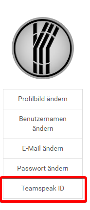
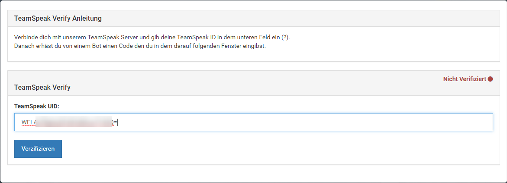
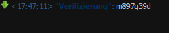
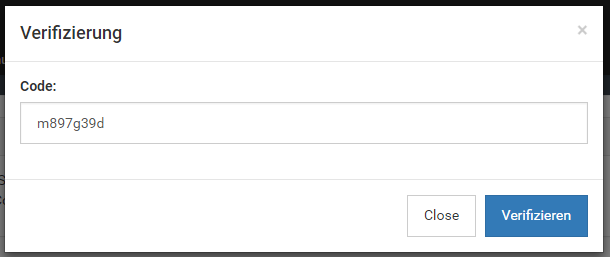
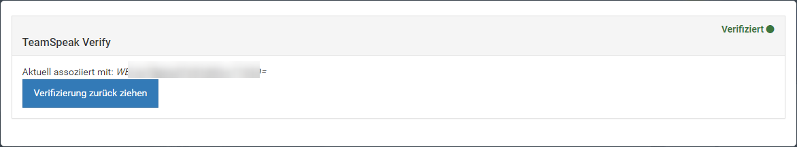

# TeamSpeak Verify Plugin for NodeBB
This Plugin allows you to associate one TeamSpeak UID with the forum user.  
After the installation and a successful configuration a new menu item in */user/:userslug/edit* becomes visible.  
  
There the user has the option to add a new TS ID. 
    
If the Client was found on the Server, the Server Query send the client a random code.
  
This random Code must be entered in the new modal.
  
If the Code is correct, the TS ID will be saved in database and the client will get the server group.
  

## Features
- Add Client to Server Group
- remove TS ID on ban
- allow Admin/Mods to modify the user